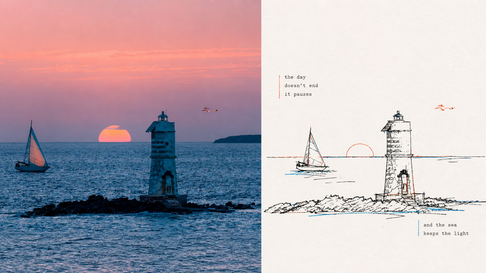
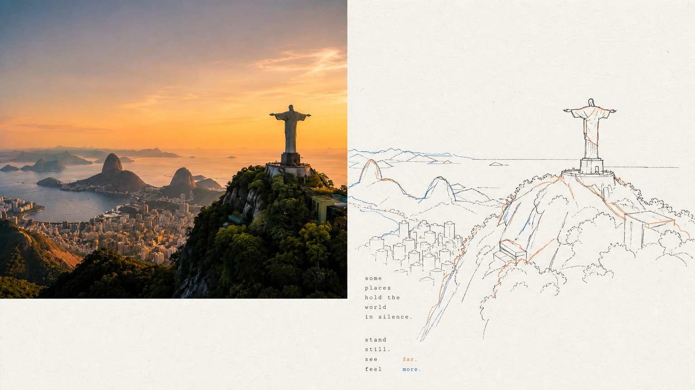
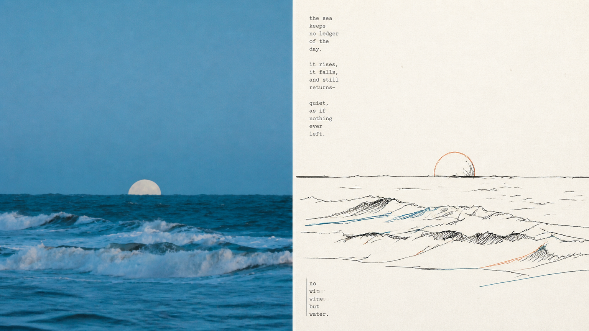
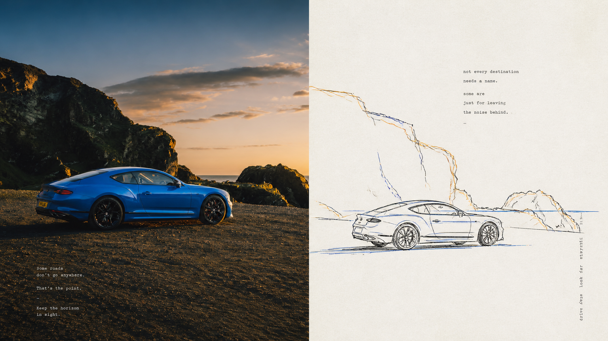
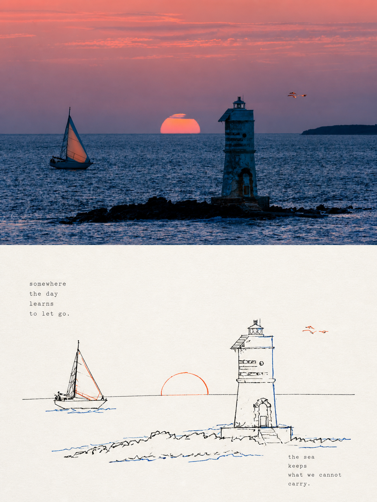
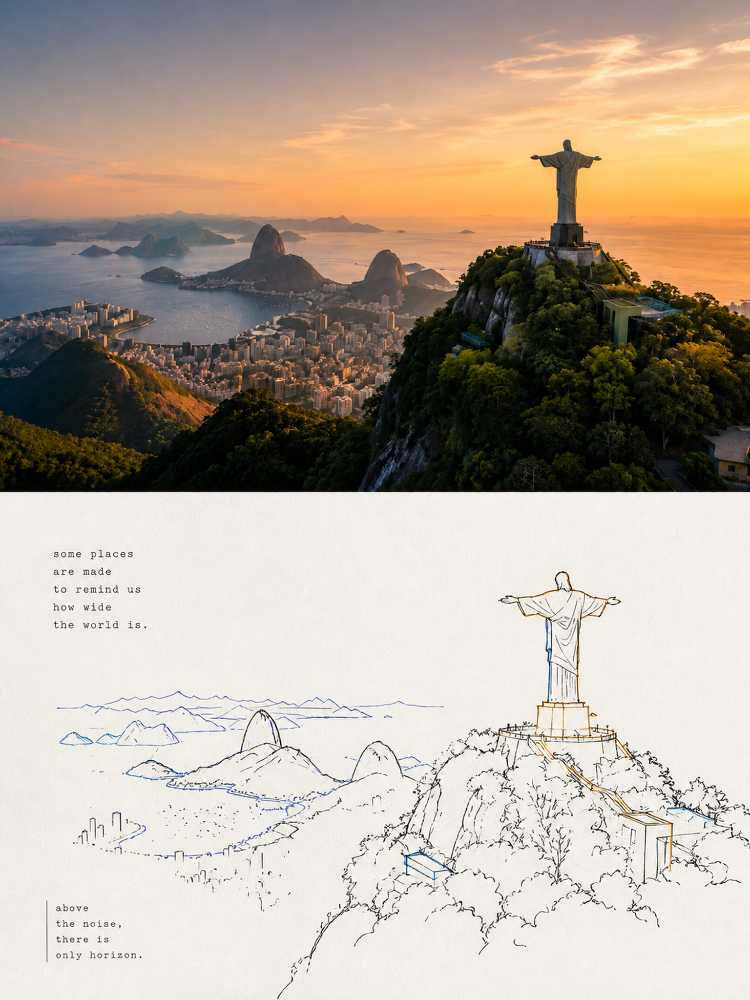
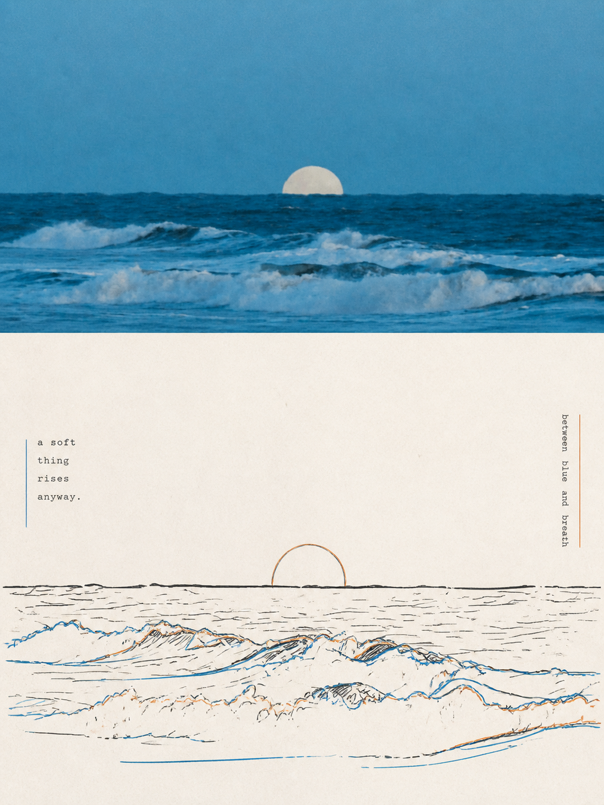
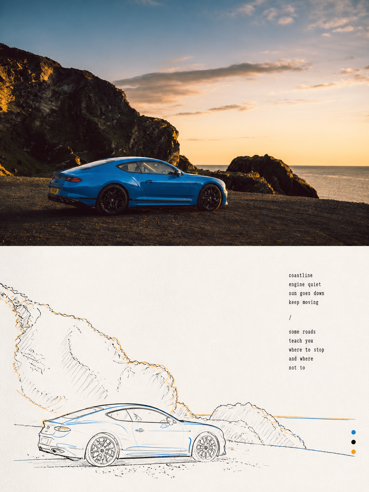

# 🦁 XXD Panel 065

### 用黑色结构线与两种源图彩线制造手绘套色节奏

Panel 065 以纤细、断续、带修正痕迹的黑色手绘线为骨架，再从照片中选出两种具有张力的强调色，让彩线与黑线轻微错位、叠压或并行。

**关键词：** 黑色结构线 · 双色强调线 · 手绘套色 · 旧印刷错位 · 微型排版

## 使用

```text
/xxd-panel-065 photo.jpg --mode design-only --size 3:4 --text prompt --locale zh-CN
```

支持单图、目录批量、四种输出模式、多尺寸与三种文字模式。完整行为见 [SKILL.md](SKILL.md)。

## 提示词权威

[简体中文原始提示词](references/original-prompt/zh-CN.md)是运行时唯一创作与审美权威。原始 X 样张位暂留；新增样张来源见[样张清单](assets/examples/README.md)。

## 新增 16:9 左右双联样张

| | |
|---|---|
|  |  |
|  |  |

## 新增 3:4 上下双联样张

| | |
|---|---|
|  |  |
|  |  |
